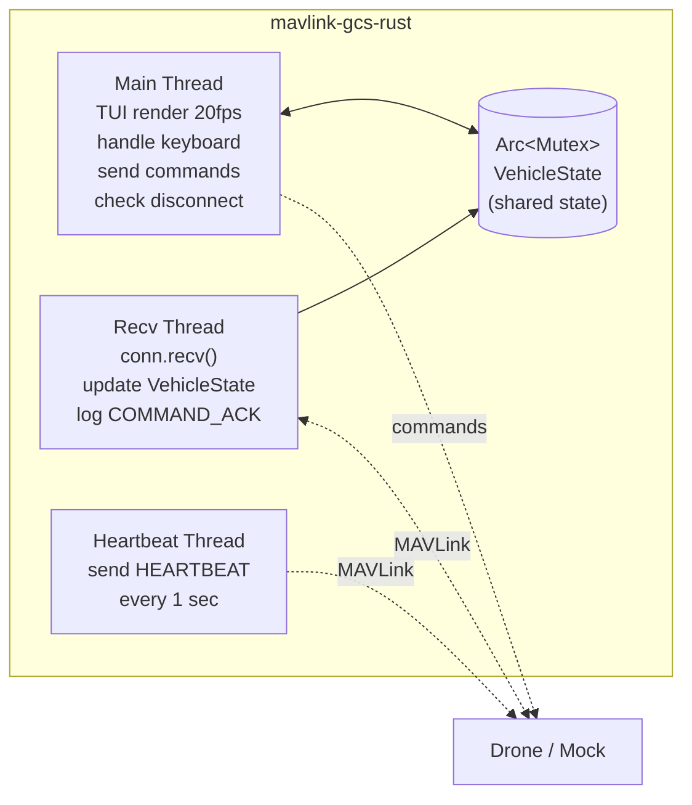
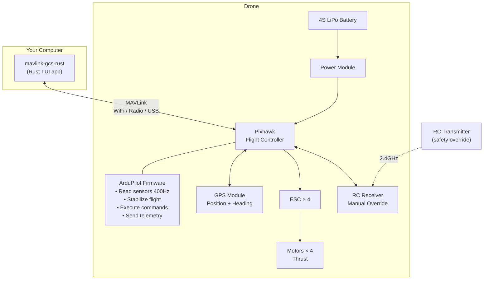

# MAVLink Ground Control Station (Rust)

A TUI-based Ground Control Station for monitoring telemetry and commanding drones via MAVLink protocol.

```
┌─ MAVLink GCS ──────────────────────────────────────────┐
│  ┌─ Status ──────────┐  ┌─ Attitude ────────────────┐  │
│  │ Conn: ✓ CONNECTED │  │ Roll:   -2.30°            │  │
│  │ Mode: GUIDED      │  │ Pitch:   1.50°            │  │
│  │ Arm:  ARMED       │  │ Yaw:    45.20°            │  │
│  └────────────────────┘  └───────────────────────────┘  │
│  ┌─ GPS ─────────────┐  ┌─ Battery ─────────────────┐  │
│  │ Lat:  13.7563000  │  │ ██████████████░░░  87%    │  │
│  │ Lon: 100.5018000  │  │ 12.4V  87%                │  │
│  │ Alt:  50.2m       │  └───────────────────────────┘  │
│  └────────────────────┘                                │
│  ┌─ Log ─────────────────────────────────────────────┐  │
│  │ 15:03:22  arm → sent                              │  │
│  │ 15:03:22  ACK: ARM_DISARM → ACCEPTED              │  │
│  │ 15:03:25  takeoff 50m → sent                      │  │
│  └───────────────────────────────────────────────────┘  │
│  > _                                                   │
└────────────────────────────────────────────────────────┘
```

## What is this?

```
┌───────────┐  MAVLink (UDP/TCP/Serial)  ┌──────────────┐
│  Your Mac │ ◄────────────────────────► │    Drone     │
│  GCS app  │     read telemetry         │  (Pixhawk +  │
│  (TUI)    │     send commands          │  ArduPilot)  │
└───────────┘                            └──────────────┘
```

- **GCS** — Software on your computer to monitor and command a drone
- **MAVLink** — Industry-standard lightweight protocol for drone communication
- **Pixhawk** — Flight controller board with onboard sensors (gyro, accel, baro, mag)
- **ArduPilot** — Open-source autopilot firmware that runs on Pixhawk

**No real drone needed** — comes with a built-in mock drone simulator for testing.

## Quick Start

```bash
# Terminal 1: Start mock drone
cargo run --bin mock_drone

# Terminal 2: Run GCS
cargo run -- -c tcpout:127.0.0.1:5760
```

## Commands

Type in the GCS and press Enter:

| Command | Action |
|---------|--------|
| `arm` | Arm motors |
| `disarm` | Disarm motors |
| `takeoff 50` | Take off to 50 meters |
| `mode guided` | Switch to GUIDED mode |
| `mode loiter` | Switch to LOITER mode |
| `goto 13.75 100.50 50` | Fly to coordinates (lat lon alt) |
| `rtl` | Return To Launch |
| `land` | Land |
| `q` / `Esc` | Quit |

Every command is sent as a MAVLink `COMMAND_LONG` and waits for `COMMAND_ACK` confirmation.

## Connection Options

```bash
# Mock drone (testing)
cargo run -- -c tcpout:127.0.0.1:5760

# ArduPilot SITL (UDP)
cargo run -- -c udpin:0.0.0.0:14550

# Real Pixhawk (Serial)
cargo run -- -c serial:/dev/tty.usbserial:57600
```

## Telemetry

Real-time data from the drone:

| Data | MAVLink Message | Rate |
|------|-----------------|------|
| GPS (lat, lon, alt, heading) | `GLOBAL_POSITION_INT` | 4 Hz |
| Attitude (roll, pitch, yaw) | `ATTITUDE` | 10 Hz |
| Battery (voltage, %) | `SYS_STATUS` | 1 Hz |
| GPS fix + satellites | `GPS_RAW_INT` | 1 Hz |
| Flight mode + armed status | `HEARTBEAT` | 1 Hz |

## Project Structure

```
src/
├── main.rs          # CLI args, thread spawning, TUI loop
├── lib.rs           # Public module exports
├── connection.rs    # MAVLink connect + send (UDP/TCP/Serial)
├── telemetry.rs     # Parse MAVLink messages → VehicleState
├── command.rs       # Parse user input → MAVLink commands
├── vehicle.rs       # Shared state + ArduCopter mode mapping
├── ui.rs            # Ratatui TUI rendering
└── bin/
    ├── mock_drone.rs    # Drone simulator for testing
    ├── test_connect.rs  # Connection test
    └── test_commands.rs # Command integration test
```

## Tech Stack

| Crate | Purpose |
|-------|---------|
| `mavlink` | MAVLink codec — ardupilotmega dialect, UDP/TCP/Serial |
| `ratatui` + `crossterm` | Terminal UI — panels, gauges, live updates |
| `clap` | CLI argument parsing |
| `anyhow` | Error handling |

## Architecture

### Software Threads



## Testing

### Option 1: Mock Drone (no setup required)

Built-in drone simulator — no dependencies, runs instantly.

```bash
# Terminal 1: Start mock drone
cargo run --bin mock_drone

# Terminal 2: Run GCS
cargo run --bin mavlink-gcs-rust -- -c tcpout:127.0.0.1:5760
```

Mock drone sends realistic telemetry (GPS, attitude, battery) and responds to commands with ACK. No physics simulation — values change instantly.

### Option 2: Real Pixhawk

Connect to a real flight controller via USB or telemetry radio.

```bash
cargo run --bin mavlink-gcs-rust -- -c serial:/dev/tty.usbserial:57600
```

### Automated Tests

```bash
cargo build          # Build
cargo clippy         # Lint (zero warnings)

# Integration test (mock drone)
cargo run --bin mock_drone -- 5762 &
cargo run --bin test_commands -- 5762
```

## Full System Architecture



### Connection Diagram


## Hardware Shopping List

Everything you need to build a drone that works with this GCS.

### Essential Components

| Component | What it does | Recommended | Est. Price |
|-----------|-------------|-------------|------------|
| **Frame** | Structure that holds everything | F450 / S500 (450-500mm quad) | $15-30 |
| **Flight Controller** | Brain — runs ArduPilot | Pixhawk 6C / Pixhawk 4 | $80-150 |
| **GPS Module** | Position + compass | M10 GPS (comes with many Pixhawk kits) | $20-40 |
| **Motors × 4** | Thrust | 2212 920KV (for 450mm frame) | $30-50 |
| **ESC × 4** | Motor speed control | 30A BLHeli_S | $20-40 |
| **Propellers** | Lift | 1045 (10 inch) — buy spares! | $5-10 |
| **Battery** | Power | 4S 5200mAh LiPo | $30-50 |
| **Battery Charger** | Charge LiPo safely | ISDT Q6 or similar balance charger | $30-50 |
| **Power Module** | Battery → Pixhawk power + voltage sensing | Comes with Pixhawk usually | $10-15 |

### For GCS Connection (pick one)

| Option | Range | What you need | Est. Price |
|--------|-------|---------------|------------|
| **USB cable** | 1 meter (bench testing) | Micro USB cable | $5 |
| **Telemetry Radio** | 300m-1km | SiK Radio 433/915MHz pair (air + ground) | $20-40 |
| **WiFi** | 50-100m | ESP8266 MAVLink WiFi bridge | $10-15 |

### For Manual Control (safety)

| Component | What it does | Recommended | Est. Price |
|-----------|-------------|-------------|------------|
| **RC Transmitter** | Manual flight control + kill switch | RadioMaster Boxer / TX16S | $80-150 |
| **RC Receiver** | Receives from transmitter | ExpressLRS receiver | $15-25 |

### Optional (for Phase 2-3)

| Component | What it does | Phase | Est. Price |
|-----------|-------------|-------|------------|
| **Companion Computer** | Runs auto-follow code on drone | Phase 2 | $35-80 |
| **Camera** | Vision tracking | Phase 3 | $25-50 |
| **UWB Module** | Precision indoor tracking | Phase 2 alt | $30-60 |

### Starter Kit Recommendation

Cheapest way to get started with a real drone:

```
Pixhawk 6C Kit (includes GPS + power module)   ~$120
F450 Frame                                      ~$15
4× 2212 920KV Motors                            ~$35
4× 30A ESC                                      ~$25
1045 Props (×3 sets)                             ~$10
4S 5200mAh LiPo Battery                         ~$40
LiPo Charger                                    ~$35
SiK Telemetry Radio (pair)                      ~$25
RadioMaster Boxer + ELRS Receiver               ~$100
─────────────────────────────────────────────────
Total                                          ~$405
```


### Important Safety Notes

- **Always have RC transmitter** as manual override — never fly with GCS only
- **Set failsafe** in ArduPilot: RTL on signal loss
- **Test on the ground first** — arm and check motor direction before flying
- **Fly in open area** — away from people, buildings, power lines
- **Check local drone regulations** before flying

## Technology Stack Overview

| Layer | Technology | Role |
|-------|-----------|------|
| **GCS Software** | Rust + mavlink crate | Monitor + command drone from computer |
| **Protocol** | MAVLink v2 | Communication between GCS ↔ drone |
| **Transport** | UDP / TCP / Serial | Physical link (radio, WiFi, USB) |
| **Firmware** | ArduPilot (ArduCopter) | Autopilot running on flight controller |
| **Hardware** | Pixhawk (ARM Cortex-M7) | Flight controller board |
| **Sensors** | GPS, Gyro, Accel, Baro, Mag | Position, orientation, altitude |
| **Actuators** | ESC + Brushless Motors | Thrust control |
| **Power** | 4S LiPo Battery | ~15 min flight time |
| **Simulation** | mock_drone (built-in Rust) | Test without hardware |

## Roadmap

- **Phase 1 (done)**: GCS core — connection, telemetry, commands, TUI
- **Phase 2**: GPS auto-follow — PID controller + `SET_POSITION_TARGET_GLOBAL_INT`
- **Phase 3**: Vision + sensor fusion — YOLO object detection + Kalman filter
