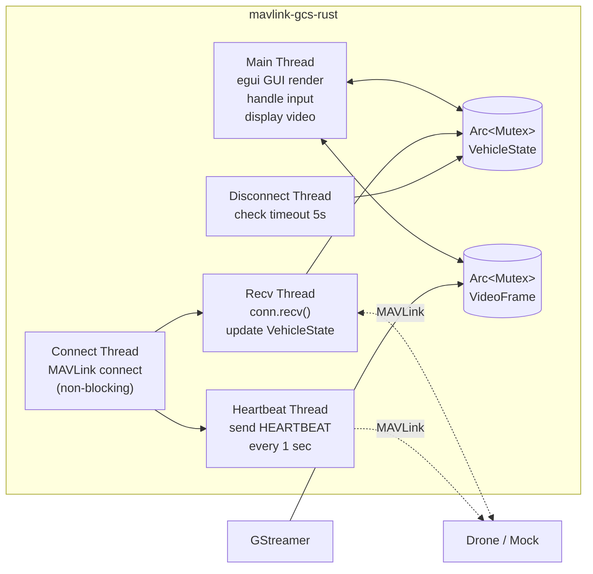
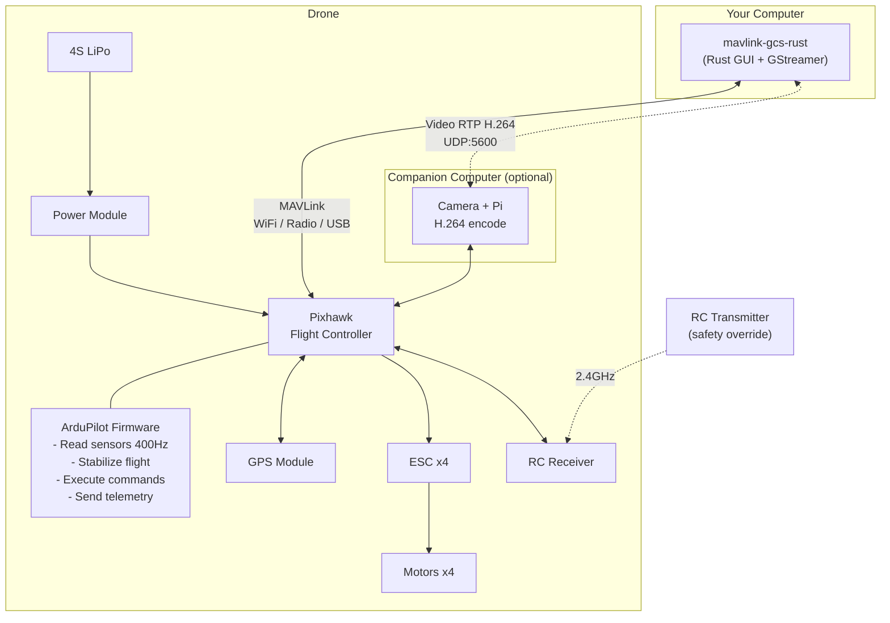
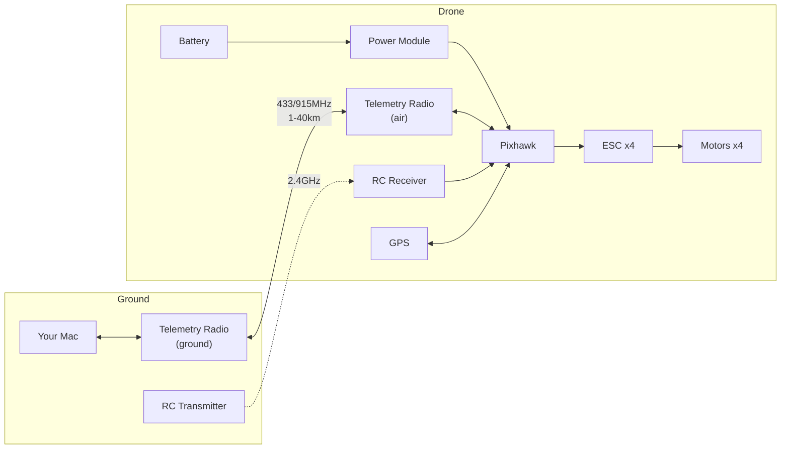

# MAVLink Ground Control Station (Rust)

A GUI-based Ground Control Station with live video feed for monitoring telemetry and commanding drones via MAVLink protocol.

```
┌─ MAVLink GCS ──────────────────────────────────────────────┐
│ ┌─ Video ─────────────────────┐ ┌─ Status ───────────────┐ │
│ │                             │ │ ● CONNECTED            │ │
│ │     Live Camera Feed        │ │ Mode: GUIDED  ARMED    │ │
│ │     (GStreamer H.264)       │ │ Bat: 12.4V 87%         │ │
│ │                             │ ├─ GPS ──────────────────┤ │
│ │                             │ │ Lat: 13.7563000        │ │
│ │                             │ │ Lon: 100.5018000       │ │
│ └─────────────────────────────┘ │ Alt: 50.2m  Hdg: 45°   │ │
│                                 ├─ Attitude ─────────────┤ │
│ ┌─ Command ────────────────────┐│ Roll: -2.30°           │ │
│ │ > arm                        ││ Pitch: 1.50°           │ │
│ │ ACK: ARM_DISARM → ACCEPTED  ││ Yaw: 45.20°            │ │
│ │ > takeoff 50                 │├─ Log ──────────────────┤ │
│ │ ACK: TAKEOFF → ACCEPTED     ││ 15:03:22 arm → sent    │ │
│ │                              ││ 15:03:22 ACK: ACCEPTED │ │
│ │ [ARM][DISARM][TAKEOFF][RTL]  │└────────────────────────┘ │
│ └──────────────────────────────┘                           │
└────────────────────────────────────────────────────────────┘
```

## What is this?


- **GCS** — Software on your computer to monitor and command a drone
- **MAVLink** — Industry-standard lightweight protocol for drone communication
- **Pixhawk** — Flight controller board with onboard sensors (gyro, accel, baro, mag)
- **ArduPilot** — Open-source autopilot firmware that runs on Pixhawk
- **GStreamer** — Video streaming framework for live camera feed

**No real drone needed** — comes with a built-in mock drone simulator for testing.

## Quick Start

```bash
# Terminal 1: Start mock drone
cargo run --bin mock_drone

# Terminal 2: Run GCS (no video)
cargo run --bin mavlink-gcs-rust -- -c tcpout:127.0.0.1:5760 --no-video

# Or with test video pattern
cargo run --bin mavlink-gcs-rust -- -c tcpout:127.0.0.1:5760 --test-video
```

## Commands

Type in the command box and press Enter, or use the quick buttons:

| Command | Action |
|---------|--------|
| `arm` | Arm motors |
| `disarm` | Disarm motors |
| `takeoff 50` | Take off to 50 meters |
| `mode guided` | Switch to GUIDED mode |
| `mode loiter` | Switch to LOITER mode |
| `goto 13.75 100.50 50` | Fly to coordinates (lat lon alt) |
| `rtl` | Return To Launch |
| `land` | Land |
| `param set FS_GCS_ENABLE 1` | Set failsafe parameter |
| `param get RTL_ALT` | Read parameter value |

Every command is sent as a MAVLink `COMMAND_LONG` and waits for `COMMAND_ACK` confirmation.

## Connection Options

```bash
# Mock drone (testing)
cargo run --bin mavlink-gcs-rust -- -c tcpout:127.0.0.1:5760

# ArduPilot SITL (UDP)
cargo run --bin mavlink-gcs-rust -- -c udpin:0.0.0.0:14550

# Real Pixhawk (Serial)
cargo run --bin mavlink-gcs-rust -- -c serial:/dev/tty.usbserial:57600
```

## Video Streaming

GCS receives live video via GStreamer (RTP H.264 on UDP port 5600).

| Flag | Effect |
|------|--------|
| (default) | Listen for video on UDP:5600 |
| `--test-video` | Show test pattern (no camera needed) |
| `--no-video` | Disable video |
| `--video-port 5601` | Custom video port |

**Drone side** (Raspberry Pi + Camera):
```bash
gst-launch-1.0 rpicamsrc bitrate=1500000 \
  ! video/x-h264,width=1280,height=720,framerate=30/1 \
  ! h264parse ! rtph264pay config-interval=1 pt=96 \
  ! udpsink host=<GCS_IP> port=5600
```

## Telemetry

Real-time data from the drone:

| Data | MAVLink Message | Rate |
|------|-----------------|------|
| GPS (lat, lon, alt, heading) | `GLOBAL_POSITION_INT` | 4 Hz |
| Attitude (roll, pitch, yaw) | `ATTITUDE` | 10 Hz |
| Battery (voltage, %) | `SYS_STATUS` | 1 Hz |
| GPS fix + satellites | `GPS_RAW_INT` | 1 Hz |
| Flight mode + armed status | `HEARTBEAT` | 1 Hz |
| Parameter values | `PARAM_VALUE` | On request |

## Project Structure

```
src/
├── main.rs          # CLI args, background MAVLink connect, GUI launch
├── lib.rs           # Public module exports
├── connection.rs    # MAVLink connect + send (UDP/TCP/Serial)
├── telemetry.rs     # Parse MAVLink messages → VehicleState
├── command.rs       # Parse user input → MAVLink commands + param set/get
├── vehicle.rs       # Shared state + ArduCopter mode mapping
├── gui.rs           # egui GUI — video + telemetry + commands
├── video.rs         # GStreamer video receiver (RTP H.264 → RGB frames)
└── bin/
    ├── mock_drone.rs    # Drone simulator for testing
    ├── test_connect.rs  # Connection test
    └── test_commands.rs # Command integration test
```

## Tech Stack

| Crate | Purpose |
|-------|---------|
| `mavlink` | MAVLink codec — ardupilotmega dialect, UDP/TCP/Serial |
| `eframe` + `egui` | Native GUI — panels, buttons, text input, live updates |
| `gstreamer` + `gstreamer-video` + `gstreamer-app` | Video decode — RTP H.264 → RGB frames → egui texture |
| `clap` | CLI argument parsing |
| `anyhow` | Error handling |

## Architecture

### Software Threads



### Full System Architecture



### Connection Diagram



## Testing

### Option 1: Mock Drone (no setup required)

Built-in drone simulator — no dependencies, runs instantly.

```bash
# Terminal 1: Start mock drone
cargo run --bin mock_drone

# Terminal 2: Run GCS
cargo run --bin mavlink-gcs-rust -- -c tcpout:127.0.0.1:5760 --no-video
```

### Option 2: Real Pixhawk

Connect to a real flight controller via USB or telemetry radio.

```bash
cargo run --bin mavlink-gcs-rust -- -c serial:/dev/tty.usbserial:57600
```

### Automated Tests

```bash
cargo build          # Build
cargo clippy         # Lint

# Integration test (mock drone)
cargo run --bin mock_drone -- 5762 &
cargo run --bin test_commands -- 5762
```

## Hardware Shopping List

Everything you need to build a drone that works with this GCS.

### Essential Components

| Component | What it does | Recommended | Est. Price |
|-----------|-------------|-------------|------------|
| **Frame** | Structure | F450 / S500 (450-500mm quad) | $15-30 |
| **Flight Controller** | Brain — runs ArduPilot | Pixhawk 6C / Pixhawk 4 | $80-150 |
| **GPS Module** | Position + compass | M10 GPS (comes with Pixhawk kits) | $20-40 |
| **Motors x4** | Thrust | 2212 920KV (for 450mm frame) | $30-50 |
| **ESC x4** | Motor speed control | 30A BLHeli_S | $20-40 |
| **Propellers** | Lift | 1045 (10 inch) — buy spares! | $5-10 |
| **Battery** | Power | 4S 5200mAh LiPo | $30-50 |
| **Battery Charger** | Charge LiPo safely | ISDT Q6 balance charger | $30-50 |
| **Power Module** | Battery to Pixhawk power | Comes with Pixhawk usually | $10-15 |

### For GCS Connection (pick one)

| Option | Range | What you need | Est. Price |
|--------|-------|---------------|------------|
| **USB cable** | 1 meter (bench testing) | Micro USB cable | $5 |
| **Telemetry Radio** | 300m-1km | SiK Radio 433/915MHz pair (air + ground) | $20-40 |
| **WiFi** | 50-100m | ESP8266 MAVLink WiFi bridge | $10-15 |

### Optional — Manual Control

| Component | What it does | Recommended | Est. Price |
|-----------|-------------|-------------|------------|
| **RC Transmitter** | Manual flight control + kill switch | RadioMaster Pocket ELRS | $60 |
| **RC Receiver** | Receives from transmitter | BetaFPV ELRS Lite | $15 |

Not required — drone can be fully controlled from Mac via GCS. But recommended for beginners as safety backup.

### Optional — Video Streaming

| Component | What it does | Est. Price |
|-----------|-------------|------------|
| **Raspberry Pi Zero 2W** | Encode + stream video | $15 |
| **Pi Camera Module** | Capture video | $25 |
| **4G USB Modem** | Long range video + telemetry | $20 |

### Starter Kit — GCS Only (no RC transmitter)

```
Holybro S500 Kit (Pixhawk 6C + GPS + PM)        ~$200
4x 30A ESC (if not in kit)                       ~$25
1045 Props (x3 sets)                             ~$10
4S 5200mAh LiPo Battery                         ~$40
LiPo Balance Charger                             ~$35
SiK Telemetry Radio 433MHz (pair)                ~$25
─────────────────────────────────────────────────
Total                                           ~$335 (~12,000 THB)
```

### Range Extension (ground side only — no weight added to drone)

| Upgrade | Effect | Price |
|---------|--------|-------|
| Replace ground antenna with **directional patch** | Range x3-5 (5-10 km) | ~$20 |
| Add **antenna tracker** | Range x5-10 (10-20 km) | ~$80 |

### Important Safety Notes

- **Set failsafe** in ArduPilot: `param set FS_GCS_ENABLE 1` — drone flies home on signal loss
- **Test on the ground first** — arm and check motor direction before flying
- **Fly in open area** — away from people, buildings, power lines
- **Check local drone regulations** before flying

## Technology Stack Overview

| Layer | Technology | Role |
|-------|-----------|------|
| **GCS Software** | Rust + egui + GStreamer | Monitor + command + video |
| **Protocol** | MAVLink v2 | Communication between GCS and drone |
| **Transport** | UDP / TCP / Serial | Physical link (radio, WiFi, USB) |
| **Video** | GStreamer (RTP H.264) | Live camera feed from drone |
| **Firmware** | ArduPilot (ArduCopter) | Autopilot running on flight controller |
| **Hardware** | Pixhawk (ARM Cortex-M7) | Flight controller board |
| **Sensors** | GPS, Gyro, Accel, Baro, Mag | Position, orientation, altitude |
| **Actuators** | ESC + Brushless Motors | Thrust control |
| **Power** | 4S LiPo Battery | ~15 min flight time |
| **Simulation** | mock_drone (built-in Rust) | Test without hardware |

## Roadmap

- **Phase 1 (done)**: GCS core — connection, telemetry, commands, GUI, video
- **Phase 2**: GPS auto-follow — PID controller + `SET_POSITION_TARGET_GLOBAL_INT`
- **Phase 3**: Vision + sensor fusion — YOLO object detection + Kalman filter
